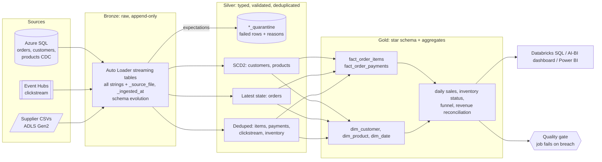

# Retail Sales & Inventory Lakehouse on Azure Databricks

[](../../actions/workflows/ci.yml)

An end-to-end medallion lakehouse for an e-commerce business. Orders, customers and products arrive as CDC feeds, clickstream arrives as events, and suppliers drop inventory files. The pipeline turns that into a governed star schema with sales, inventory and funnel analytics, and refuses to publish data that fails its quality gate.

It runs on **Azure Databricks** (Lakeflow Declarative Pipelines, Auto Loader, Unity Catalog, Asset Bundles) and also **locally with plain PySpark**, so all the business logic is unit-tested in CI.

## The problem

Sales data lived in three places: an operational database, a clickstream feed and supplier files. Reports were a day late and teams didn't trust the numbers, because each team joined the data its own way. The goals:

- One governed platform with near-real-time sales visibility
- Trustworthy numbers: bad data quarantined and visible, revenue reconciled against payments
- Inventory status (days of cover, low-stock alerts) and a clean dataset for demand forecasting

## Architecture



| Layer | What happens | Databricks | Locally |
|---|---|---|---|
| Ingest | Each file read exactly once; new columns added automatically | Auto Loader (`cloudFiles`), Event Hubs via Kafka API | File log in `ops_ingested_files`, `unionByName(allowMissingColumns)` |
| Bronze | Raw values as strings, plus lineage columns | Streaming tables | Delta or Parquet tables |
| Silver | Cast, validate, quarantine, deduplicate, SCD2 | Expectations + `AUTO CDC` flows | Same rules, `dedupe_latest`, `apply_scd2`, watermarks |
| Gold | Star schema, as-of joins, aggregates | Materialized views | Rebuilt from silver |
| Serve | Dashboards, ad-hoc SQL | SQL warehouse, AI/BI dashboard | `sql/dashboard_queries.sql` |

## The messy data it handles

The generator (`src/retail_lakehouse/generate.py`) deliberately produces the problems real pipelines hit. Each one has a test.

| Problem | Example | How it's handled |
|---|---|---|
| Duplicate CDC events | Source re-sends 117 order events | Dedupe on primary key, ordered by change timestamp then LSN |
| Out-of-order and late events | A stale "approved" event arrives after the order was delivered | Latest state is decided by event time, never by arrival order |
| Late SCD2 changes | A customer's segment change from 10 Sep arrives on 16 Sep | `apply_scd2` rebuilds the version chain for affected keys, so the late version slots into the middle of history |
| Bad rows | Negative or unparseable prices, zero quantities, empty keys | Quarantined with the original raw values and the list of failed rules |
| Orphan keys | Order line for a product that doesn't exist | Referential check sends it to quarantine |
| Schema drift | Supplier files gain a `warehouse_code` column | Column added to bronze; older rows default to `MAIN` |
| Revenue fan-out | Orders paid with a voucher plus a card | Payments aggregated per order *before* joining, plus a reconciliation table |
| At-least-once delivery | Duplicate clickstream events | Dedupe on `event_id` (streaming: `dropDuplicatesWithinWatermark`) |

## Results from a local run

Two arrival batches (1-14 Sep, then 15-21 Sep), from `./scripts/run_local_demo.sh`:

- **12,242** clickstream events → **11,772** after removing 470 duplicates
- **3,772** order CDC events → **1,029** orders in their correct latest state (no stale event won)
- **34** bad order lines and payments quarantined with reasons, **0** reached gold
- **400** customers with **442** SCD2 versions; prices in the fact table match the product version valid at purchase time for **all 1,520** order lines
- The naive items × payments join would have reported **$405,877** of sales instead of the correct **$346,076**, overstating revenue by about **17%**
- **27 of 1,029** orders (2.6%) don't reconcile and aren't explained by quarantine; the quality gate tolerates up to 3%
- Re-running with no new files changes nothing (idempotent), and a batch 2 schema change was absorbed without a code change
- Inventory: **10** products low on stock and **1** out of stock, flagged by days of cover

## Quality gate

`quality-report` runs as the last task of the Databricks job and exits non-zero (failing the job and triggering the alert) if any check fails:

```
check                                          value     limit  result
quarantine_rate.order_items                   0.0192      0.05  PASS  30/1560 rows
revenue_reconciliation                        0.0262      0.03  PASS  27/1029 orders unexplained
fact_order_items.unique_grain                      0         0  PASS  0 duplicate keys
gold_dim_customer.one_current_version              0         0  PASS
fact_order_items.unknown_members                 0.0      0.01  PASS  0/1520 rows
freshness_hours.orders                          0.02      48.0  PASS
```

Results are appended to `ops_quality_results` for the ops dashboard.

## Run it locally

Needs Python 3.10+ and Java 17+.

```bash
python -m venv .venv && source .venv/bin/activate
pip install -e ".[dev]"
./scripts/run_local_demo.sh       # two batches + quality gate, about 2-3 minutes
pytest                            # 17 tests, including an end-to-end run
```

Tables are written as Delta Lake. If the Delta jars can't be downloaded (offline), it falls back to Parquet automatically. Force a format with `LAKEHOUSE_FORMAT=delta|parquet`.

## Deploy to Azure Databricks

1. **Provision Azure** (resource group, ADLS Gen2, Premium Databricks workspace, Access Connector, Event Hubs, Key Vault):
   ```bash
   az login && ./infra/setup_azure.sh
   ```
2. **Set up Unity Catalog**: run `sql/unity_catalog_setup.sql` in the workspace. This creates the catalog, schemas, landing volume, PII-masking view and grants.
3. **Point the bundle at your workspace**: set `workspace.host` in `databricks.yml`.
4. **Deploy and run**:
   ```bash
   databricks bundle deploy -t dev
   databricks bundle run retail_demo_data -t dev --params batch=1
   databricks bundle run retail_lakehouse_job -t dev
   ```
5. **Stream clickstream** (optional): set `clickstream_source: eventhubs` in `resources/retail_pipeline.yml`, then run `python scripts/clickstream_producer.py --file landing/clickstream/batch_002.json`.

### CI/CD

| Workflow | Trigger | What it does |
|---|---|---|
| `ci.yml` | Pull request | Ruff lint and format check, then the full pytest suite on Delta Lake |
| `deploy.yml` | Push to `main` | Tests, then `bundle validate` and `bundle deploy -t dev`, then a smoke run |
| `deploy.yml` | Tag `v*` | Tests, then deploy to `prod` (the GitHub `production` environment can require approval) |

Add `DATABRICKS_HOST`, `DATABRICKS_CLIENT_ID` and `DATABRICKS_CLIENT_SECRET` (a service principal with OAuth) as repository or environment secrets. Until they're set, the deploy step skips itself.

## Design decisions

- **Bronze keeps everything as strings.** Silver can always be rebuilt from bronze, and a bad value becomes a quarantined row instead of a failed load.
- **Quarantine, don't drop.** Every failed row is kept with its raw values and the names of the rules it broke, so data issues are visible and can be fixed at the source.
- **One definition of quality.** Rules are SQL expressions in `quality.py`, used by local tests *and* by `@dlt.expect_all_or_drop` on Databricks.
- **SCD2 by rebuilding affected keys.** A plain MERGE that closes the current row corrupts history when an old change arrives late. Rebuilding the version chain for only the keys in the batch is idempotent and order-independent.
- **Deterministic surrogate keys** (hash of business key + effective date) instead of `monotonically_increasing_id`, so reruns produce the same keys.
- **As-of joins** so revenue by region uses the customer's address at the time of the order.
- **Aggregate before joining** payments to order lines, with a reconciliation table that explains every mismatch.
- **Security**: secrets in a Key Vault-backed scope, storage through a managed identity, PII masked by group membership, analysts granted gold only.
- **Cost**: serverless pipelines and jobs, schedules paused in dev, liquid clustering on large tables.

## Repository layout

```
├── databricks.yml                 # Asset Bundle: dev and prod targets
├── resources/                     # pipeline and job definitions
├── pipelines/retail_pipeline.py   # Lakeflow Declarative Pipeline (Databricks)
├── src/retail_lakehouse/
│   ├── generate.py                # synthetic messy source data
│   ├── bronze.py                  # exactly-once ingest, schema drift
│   ├── silver.py                  # typing, dedupe, SCD2, quarantine
│   ├── gold.py                    # star schema, as-of joins, aggregates
│   ├── quality.py                 # rules shared with Lakeflow expectations
│   ├── checks.py                  # post-load quality gate
│   ├── pipeline.py                # local/batch orchestration + run metrics
│   └── storage.py                 # Delta / Parquet / Unity Catalog I/O
├── tests/                         # unit + end-to-end tests
├── sql/                           # Unity Catalog setup, dashboard queries
├── infra/setup_azure.sh           # Azure provisioning
├── scripts/                       # local demo, Event Hubs producer
└── .github/workflows/             # CI and deployment
```

## What I'd add next

- A demand-forecasting model on `gold_fact_order_items`, tracked in MLflow and registered in Unity Catalog
- Lakehouse Monitoring on gold tables for drift in revenue and conversion
- Swapping the synthetic CDC for the Olist e-commerce dataset loaded into Azure SQL with Lakeflow Connect
